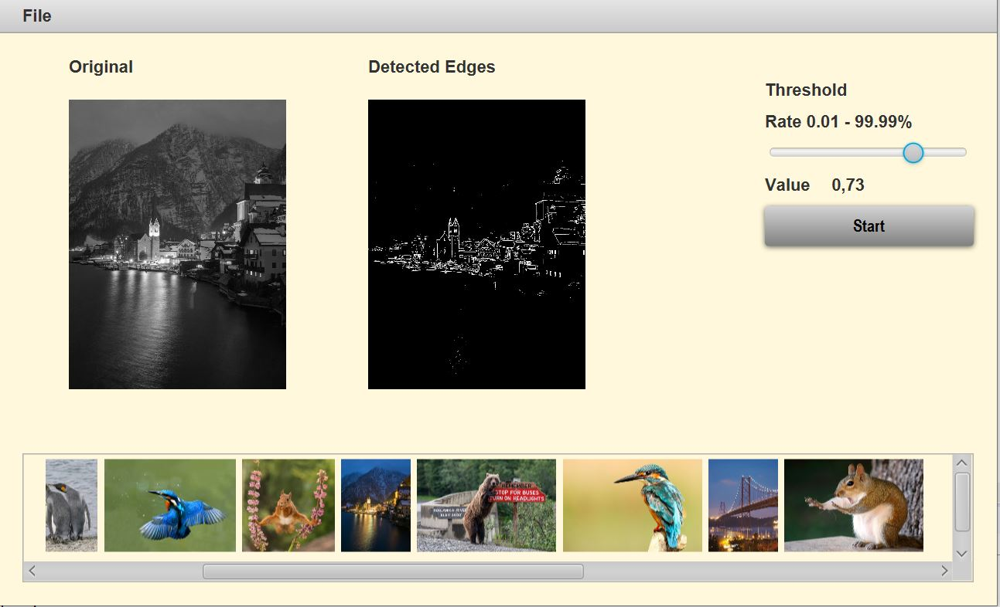

# Edge Detection-CaseStudy

This project is the starting point for an exercise to speedup an Java application by applying parallel concepts.

This project is part of a lesson hold on the **University of Applied Sciences Kaiserslautern**.

Remark: The project was build with OpenJDK 11 

Main class: `app.EdgeDetection`

Build command:

`mvn clean package`

The command create a lib and module directory that contains the dependencies and module runnable.

Start the application:

`java -p modules;lib -m edgeDetection/app.EdgeDetection`

---

### The Show Case Application

The application offers a simple user interface. You can load a directory with jpg- and png-files. The contents of the directory are shown at the bottom of the UI.

A selected image is converted to a gray colored image and is displayed on the left. By pushing the start button the 
<code>getEdgeDetectedImage</code> method of the class <code>app.util.alg.SobelOperator</code> is called. 

The actual implementation makes a copy of the image. The result shown on the right. 

---

### Exercise
Implement the [Sobel edge detection](https://en.wikipedia.org/wiki/Sobel_operator) operation in the <code>getEdgeDetectedImage</code> method. The return value should be a pixel buffer with the corresponding edge image. With the slider there can be set threshold that can be used to sharpen the image. 

